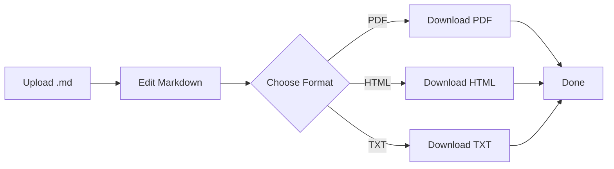

# Markdown Conversion Flow

This sample file tests **headings**, lists, and a **Mermaid flowchart** diagram.

## How MarkdownTools Works

1. Upload or paste your `.md` file
2. Preview updates live on the right
3. Export to PDF, HTML, or TXT

## Process Diagram (Mermaid)

## Notes

> All conversion runs **in your browser**. Nothing is uploaded to a server.

| Step | Action        | Output   |
|------|---------------|----------|
| 1    | Write Markdown| Source   |
| 2    | Live preview  | Rendered |
| 3    | Export        | File     |

**Tip:** Use this file to test PDF layout with code blocks and tables.
