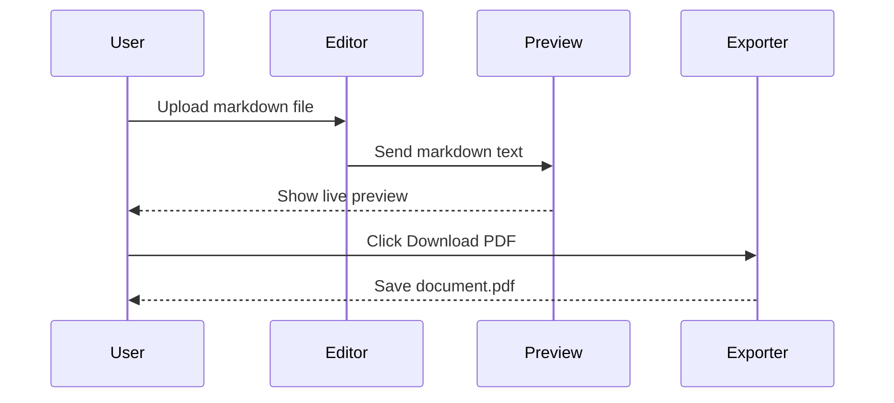
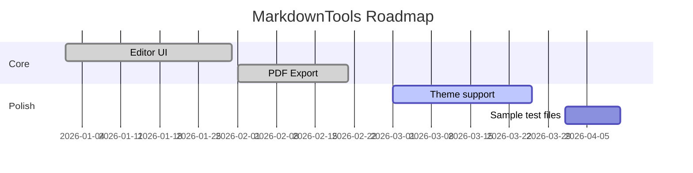

# Product Roadmap & Sequence Diagrams

Use this file to test **complex documents** with multiple diagram types.

## Q2 Roadmap

| Feature            | Status      | Priority |
|--------------------|-------------|----------|
| PDF export         | Shipped     | High     |
| HTML export        | Shipped     | High     |
| TXT export         | Shipped     | Medium   |
| Diagram support    | In progress | Medium   |

## User Journey (Mermaid Sequence)



## Release Timeline (Mermaid Gantt)



## Entity Relationship (ASCII)

```
  ┌──────────┐       writes        ┌──────────┐
  │  Author  │ ──────────────────► │ Markdown │
  └──────────┘                     └────┬─────┘
                                          │ converts
                    ┌─────────────────────┼─────────────────────┐
                    ▼                     ▼                     ▼
              ┌──────────┐          ┌──────────┐          ┌──────────┐
              │   PDF    │          │   HTML   │          │   TXT    │
              └──────────┘          └──────────┘          └──────────┘
```

## Summary

Ship **v2.0** with:

1. Unified converter editor on all tool pages
2. Upload `.md` from toolbar
3. Side-by-side preview before export

**Bold**, *italic*, and `inline code` should all render correctly in preview and PDF.
