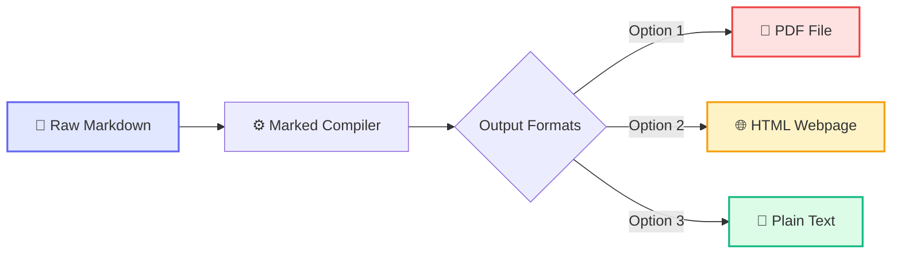
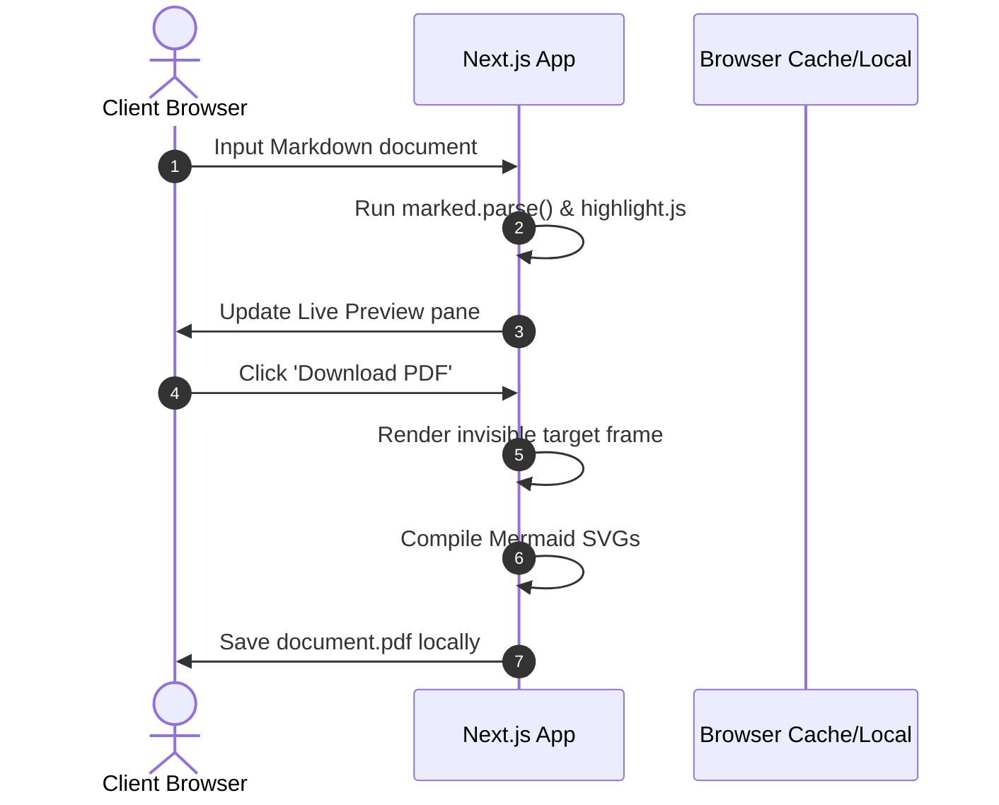
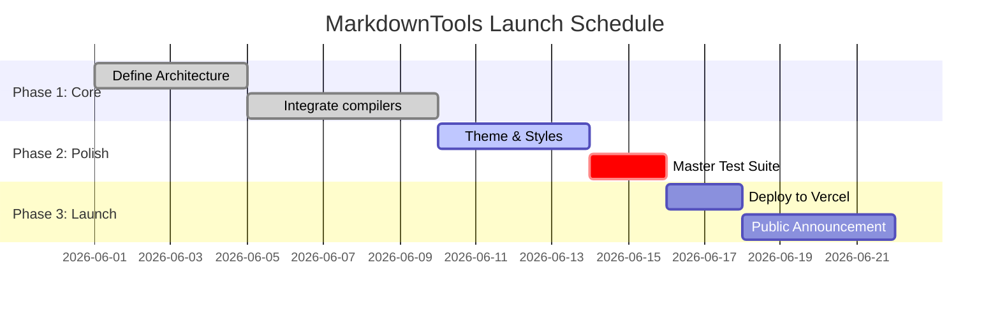
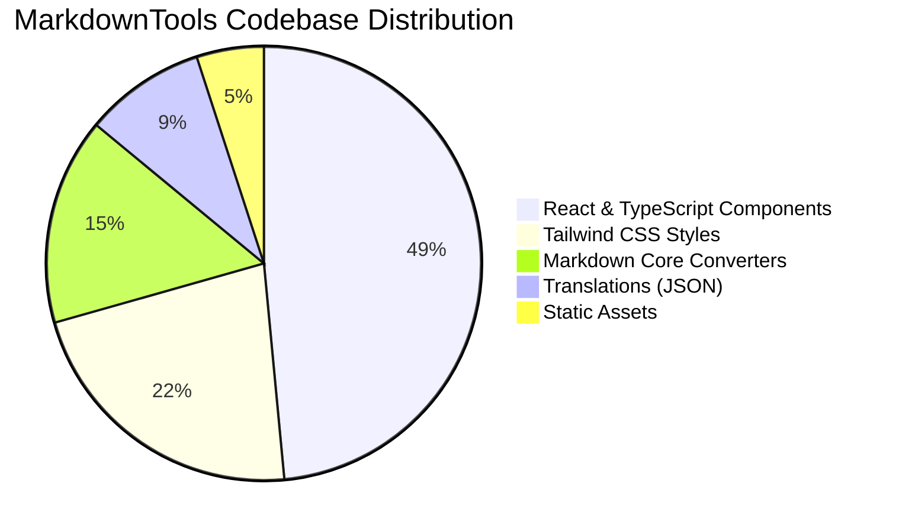

# 🚀 MarkdownTools Master Test Suite

This master markdown document is designed to test all elements of the **Markdown to PDF, HTML, and TXT** converters. It covers typography, layout tables, syntax highlighting, HTML integration, inline CSS styles, custom page breaks, images, and Mermaid diagrams.

---

## 📋 Table of Contents
1. [Typography & Text Elements](#1-typography--text-elements)
2. [Lists & Task Lists](#2-lists--task-lists)
3. [Tables & Alignments](#3-tables--alignments)
4. [Syntax Highlighting](#4-syntax-highlighting)
5. [Custom Page Breaks & HTML Features](#5-custom-page-breaks--html-features)
6. [Mermaid Diagrams](#6-mermaid-diagrams)
7. [Visual Media & Images](#7-visual-media--images)

---

## 1. Typography & Text Elements

Testing standard Markdown text structures and heading levels:

# Heading 1 (Document Title)
## Heading 2 (Major Section)
### Heading 3 (Sub-section)
#### Heading 4 (Sub-sub-section)
##### Heading 5 (Minor section)
###### Heading 6 (Detail section)

Here is a paragraph showcasing different text styles:
* This text is **bold** (strong).
* This text is *italic* (emphasis).
* This text combines ***bold and italic***.
* This is a ~~strikethrough~~ text.
* Here is an `inline code block` in the middle of a sentence.
* You can also use [Hyperlinks](https://github.com) or [referenced links][my-link].

> **Blockquote Test:** This is a standard markdown blockquote. It should have a nice left border, rounded corners, and a subtle background color in both the preview and the exported PDF.
> 
> > **Nested Blockquote:** You can nest quotes to show replies or secondary references.

[my-link]: https://nextjs.org "Next.js Reference"

<div style="page-break-after: always;"></div>

## 2. Lists & Task Lists

Here we test bullet points, ordered indexing, indentation levels, and checklist states.

### Unordered Lists (Nested)
- Primary Bullet A
  - Secondary Bullet A1
  - Secondary Bullet A2
    - Tertiary Bullet A2a
- Primary Bullet B

### Ordered Lists
1. First step in the process
2. Second step in the process
   1. Sub-step 2a
   2. Sub-step 2b
3. Third step in the process

### Task Lists (Checklists)
- [x] Integrate HTML-to-PDF parser (`html2pdf.js`)
- [x] Implement live syntax highlighting (`highlight.js`)
- [x] Add real-time Mermaid diagram compilation (`mermaid.js`)
- [ ] Implement cloud-sync backup (Planned feature)
- [ ] Add custom page margins in UI settings

---

## 3. Tables & Alignments

Tables must align columns correctly and handle cells of varying lengths.

| ID | Feature Name | Description | Status | Priority |
| :--- | :---: | :--- | :---: | ---: |
| **01** | PDF Export | Offline client-side PDF compiler | `Active` | **High** |
| **02** | Live Preview | Side-by-side split pane render | `Active` | **High** |
| **03** | Auto-save | Stores content in LocalStorage | `Pending` | **Medium** |
| **04** | Cloud Sync | Shared web workspace sync | `Idea` | **Low** |

*Note: The table columns are left-aligned, centered, left-aligned, centered, and right-aligned respectively.*

<div style="page-break-after: always;"></div>

## 4. Syntax Highlighting

This section tests the syntax highlighting library (`highlight.js`) with multiple languages.

### Javascript (React Component)
```javascript
import React, { useState } from 'react';

export function Counter() {
  const [count, setCount] = useState(0);
  
  return (
    <div className="p-4 border rounded-xl bg-slate-50">
      <p className="text-sm font-bold">Current Count: {count}</p>
      <button 
        onClick={() => setCount(prev => prev + 1)}
        className="px-3 py-1 bg-indigo-600 text-white rounded-md"
      >
        Increment
      </button>
    </div>
  );
}
```

### Python (Data Processing)
```python
def calculate_metrics(data_points):
    """Calculate basic statistical metrics for a list of data points."""
    if not data_points:
        return {"mean": 0.0, "count": 0}
        
    total = sum(data_points)
    count = len(data_points)
    mean = total / count
    
    return {
        "mean": mean,
        "count": count,
        "sum": total
    }

# Test the function
print(calculate_metrics([12, 15, 18, 22, 25]))
```

### CSS Variables
```css
:root {
  --primary-color: #6366f1;
  --secondary-color: #4f46e5;
  --bg-gradient: linear-gradient(135deg, #e0e7ff 0%, #f3f4f6 100%);
  --border-radius: 8px;
  --box-shadow: 0 4px 6px -1px rgba(0, 0, 0, 0.1);
}
```

<div style="page-break-after: always;"></div>

## 5. Custom Page Breaks & HTML Features

This section tests the parser's compatibility with standard HTML elements inside Markdown.

### Page Breaks
To force a page break in the PDF export, you can place a `<div style="page-break-after: always;"></div>` tag directly in your Markdown file. The pages before and after this section should split cleanly.

### Styled Badges & Inline Elements
You can write custom HTML badges like this:
* Status: <span style="background: #dcfce7; color: #15803d; padding: 2px 8px; border-radius: 9999px; font-size: 11px; font-weight: 700; border: 1px solid #bbf7d0;">COMPLETED</span>
* Priority: <span style="background: #fee2e2; color: #b91c1c; padding: 2px 8px; border-radius: 9999px; font-size: 11px; font-weight: 700; border: 1px solid #fecaca;">CRITICAL</span>
* Theme: <span style="background: #fef3c7; color: #d97706; padding: 2px 8px; border-radius: 9999px; font-size: 11px; font-weight: 700; border: 1px solid #fde68a;">GLOWING-DARK</span>

### Accordions & Dropdowns
Using the HTML `<details>` and `<summary>` tags:

<details>
  <summary>🔍 Click to expand troubleshooting instructions</summary>
  <p style="padding: 10px; background: #f8fafc; border-left: 3px solid #6366f1; margin-top: 5px;">
    If diagrams do not render properly in the PDF export, verify that they are correctly written in <code>```mermaid</code> block tags and that no syntax errors are present in the diagram definition.
  </p>
</details>

---

## 6. Mermaid Diagrams

These interactive diagrams are compiled live. They must scale correctly and avoid page clipping during PDF conversion.

### A. Process Flowchart (Horizontal)


<div style="page-break-after: always;"></div>

### B. User Authentication (Sequence Diagram)


### C. Project Launch Timeline (Gantt Chart)


### D. System Distribution (Pie Chart)


<div style="page-break-after: always;"></div>

## 7. Visual Media & Images

This section tests how both local and external images are rendered and styled.

### A. Local Project Asset (Glow Banner)
Below is the generated vector logo banner representing MarkdownTools. It is loaded locally from the public directory.


### B. External High-Resolution Photograph
This photo is fetched dynamically from Unsplash to test remote asset resolution, scale matching, and CORS handling.


---

*End of the Master Test Suite. Use this sample file to verify perfect pixel rendering in your web converters!*
